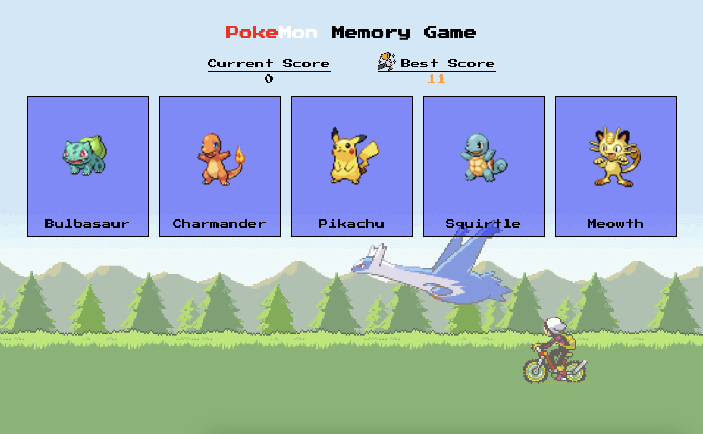

# Pokemon Memory Card

The **Pokemon Memory Card** project is created according to the assignment from **The Odin Project** [course](https://www.theodinproject.com/paths/full-stack-javascript/courses/react).
 
 

Pokemon Memory Card Game is a fun game to test your memory skills while immersing you in the Pokemon universe. You can click the same pokemon only **once** per round!

### 🔗 **Live preview** of the project is [here](https://berk-pokemon-memory-app.netlify.app/).

## **Features**

- Loading page
- Difficulty level
- React Hooks

## Getting Started

In order to setup and work on this project on your own, you will need to:

1. Clone this project:  
   ssh: `git clone git@github.com:berkgirgin/Memory_Card_App.git`
    
   https: `git clone https://github.com/berkgirgin/Memory_Card_App.git`

2. Once you have cloned this project, you can install the required dependencies by using:  
   `npm install`

3. A live demo of the project can be started by using:  
   `npm run preview`

4. Distribution files can be produced using:  
   `npm run build`
